# Proyecto Gestión de Coches 🚗

## Introducción

(Diagrama de caso al final del todo)

En un mundo cada vez más conectado, la gestión de datos y servicios mediante arquitecturas cliente-servidor es fundamental. Este proyecto implementa un **servidor de gestión de coches**, diseñado siguiendo los principios de la **Clean Architecture**. Su propósito es proporcionar una solución robusta y escalable para gestionar una base de datos de coches y usuarios.

El sistema incluye funcionalidades como:  
- Registro, inicio y cierre de sesión de usuarios.  
- Operaciones CRUD (*Create, Read, Update, Delete*) sobre los datos de coches.  
- Gestión de conexiones simultáneas de múltiples clientes.  

Este proyecto es una excelente demostración de cómo estructurar aplicaciones complejas de manera modular, separando las responsabilidades en capas claras:  
1. **Application**: Gestión de peticiones y respuestas HTTP.  
2. **Domain**: Lógica de negocio y casos de uso.  
3. **Data**: Acceso a datos.  
4. **Infrastructure**: Conexión entre cliente y servidor.  
5. **Main**: Punto de entrada del programa.  

## Objetivo

El objetivo principal de este programa es ofrecer un **sistema eficiente y seguro** que permita a los usuarios interactuar con un servidor para consultar, registrar y gestionar información de coches, asegurando que solo los usuarios autenticados puedan realizar modificaciones sensibles.

¡Prepárate para explorar una solución de software construida para destacar por su **calidad, claridad y escalabilidad**! 🚀

## Estructura del proyecto

```plaintext
- cliente
    - ClienteCoche.java
- servidor
    - application
        - Routing.java
    - data
        - repository
            - RepositoryCoche.java
    - domain
        - interfaces
            - GenericRepositoryInterface.java
            - RestInterface.java
        - model
            - Coche.java
            - Usuario.java
        - usercase
            - LoginUsuario.java
            - LogoutUsuario.java
            - AddCoche.java
            - DeleteCoche.java
            - GetCochePorId.java
            - GetCochePorModelo.java
            - GetListaCoches.java
            - PutCoche.java
            - PostCoche.java
            - RegistroUsuario.java
    - infrastructure
        - server
            - ServidorCocheHilo.java
    - main
        - ServidorCoche.java
```
# Cliente Coche 

Este archivo README describe la funcionalidad y arquitectura del cliente para la aplicación de gestión de coches basada en la metodología Clean Architecture.

---

## **Descripción del Cliente**

El cliente se comunica con un servidor utilizando sockets. Permite la interacción con el servidor mediante comandos ingresados en la línea de comandos y maneja las respuestas recibidas del servidor. La funcionalidad del cliente incluye:

- Conexión al servidor especificando una dirección IP y un puerto.
- Envío de comandos al servidor.
- Recepción de respuestas del servidor.
- Finalización de la sesión mediante el comando `fin`.

---

## **Código Fuente**

```java
package cliente;

import java.io.BufferedReader;
import java.io.IOException;
import java.io.InputStreamReader;
import java.io.PrintWriter;
import java.net.InetAddress;
import java.net.Socket;
import java.net.UnknownHostException;
import java.util.Scanner;

public class ClienteCoche {
    private static Socket socket; //socket muy importante
    public static void main(String[] args) {
        //PARAMETROS QUE VAMOS A IR NECESITANDO
        int puertoServidor; //el puerto que le asignare al servidor como argumento
        InetAddress serverIp;
        String lineaArgumento;

        /**
         * Comprobamos que el cliente ha puesto bien el 
         * numero de parametros para realizar el ejercicio
         */
        if (args.length < 2){
            System.out.println("Error en numero de argumentos");
            System.out.println("Asegurate de poner bien los argumentos");
            System.exit(1);
        }
        puertoServidor = Integer.parseInt(args[1]);

        try {
            socket = new Socket(args[0], puertoServidor);
            serverIp = socket.getInetAddress();
            System.out.printf("Cliente conectado con el servidor por el puerto %s....%n",
             serverIp.getHostAddress()); //saco informacion del socket para transmitirlo por pantalla
            
            //creo el flujo de entrada de los comandos que pondra el usuario en la linea de comandos
            Scanner scanner = new Scanner(System.in);
            //creo el flujo de salida que conectara la salida del cliente por la entrada del servidor
            PrintWriter pw = new PrintWriter(socket.getOutputStream());
            //creo un flujo de entrada para recibir los datos que me devuelva el servidor
            BufferedReader reader = new BufferedReader(new InputStreamReader(socket.getInputStream()));


            boolean exit=false;
            do {
                System.out.println("ECHO");
                lineaArgumento = scanner.nextLine();
                pw.println(lineaArgumento);
                pw.flush();

                if (lineaArgumento.equals("fin")){ // si es fin se termina la interaccion con el cliente
                    exit=true;  //para salir del bucle
                    socket.close();
                    pw.close();
                    scanner.close();
                }else {
                    //si no nos preparamos para recibir lo que nos mande el servidor
                    String respuestaServidor = reader.readLine();
                    
                    System.out.println(respuestaServidor);
                }
                
            } while (!exit);

        }catch (UnknownHostException ex){
            System.out.printf("Servidor desconocido %s%n", args[0]);
            ex.printStackTrace();
            System.exit(2);
        }catch (IOException e){
            System.out.println("Error en flujo de E/S");
            e.printStackTrace();
            System.exit(3);    

        }
    }
    
}
```

---

## **Cómo usar el cliente**

1. **Compilación del programa:**
   Asegúrate de tener configurado tu entorno de Java.
   ```bash
   javac ClienteCoche.java
   ```

2. **Ejecución del cliente:**
   ```bash
   java ClienteCoche <ip_servidor> <puerto_servidor>
   ```
   - `<ip_servidor>`: Dirección IP del servidor al que deseas conectarte.
   - `<puerto_servidor>`: Puerto en el que el servidor está escuchando.

3. **Interacción:**
   - Ingresa comandos directamente en la consola.
   - Para finalizar la sesión, ingresa el comando `fin`.

---

## **Arquitectura**

### Clean Architecture en el Cliente

El cliente es una parte esencial del sistema que sigue la metodología Clean Architecture, manteniendo responsabilidades claras y separadas. Este cliente:

1. **Comunicación:**
   - Establece una conexión mediante sockets.
   - Gestiona la entrada del usuario y la salida hacia el servidor.

2. **Separación de Responsabilidades:**
   - **main:** Inicia el cliente y gestiona el flujo principal de ejecución.
   - **Socket:** Maneja la comunicación entre cliente y servidor.
   - **Flujos de E/S:** Encapsula la interacción de entrada y salida.

---

## **Notas Adicionales sobre el cliente**

- El cliente requiere parámetros válidos para ejecutar correctamente.
- Gestiona los errores de conexión y flujo de entrada/salida para garantizar la estabilidad.
- La implementación debe extenderse con más funcionalidades conforme lo requiera el sistema.

---

# Servidor Coche - Documentación

Este archivo README describe la funcionalidad y arquitectura del servidor para la aplicación de gestión de coches basada en la metodología Clean Architecture.

---

## **Estructura del Proyecto**

El servidor está organizado en múltiples capas según la metodología Clean Architecture:

- **application:** Contiene la lógica de enrutamiento que administra las peticiones de los clientes.
- **data:** Implementa los repositorios para el acceso a datos.
- **domain:** Incluye la lógica de negocio, interfaces, modelos y casos de uso.
- **infrastructure:** Gestiona los hilos y la comunicación con los clientes.
- **main:** Punto de entrada del servidor, inicializa el enrutamiento y comienza a escuchar conexiones.

### **Ubicación del Código**

```plaintext
- servidor
    - application
        - Routing.java
    - data
        - repository
            - RepositoryCoche.java
    - domain
        - interfaces
            - GenericRepositoryInterface.java
            - RestInterface.java
        - model
            - Coche.java
            - Usuario.java
        - usercase
            - LoginUsuario.java
            - LogoutUsuario.java
            - AddCoche.java
            - DeleteCoche.java
            - GetCochePorId.java
            - GetCochePorModelo.java
            - GetListaCoches.java
            - PutCoche.java
            - PostCoche.java
            - RegistroUsuario.java
    - infrastructure
        - server
            - ServidorCocheHilo.java
    - main
        - ServidorCoche.java
```

---

# Servidor

## **Servidor Principal (main/ServidorCoche.java)**

El archivo `ServidorCoche.java` contiene el punto de entrada del servidor y es responsable de:

1. Validar los argumentos de entrada para asegurar que se proporciona un puerto válido.
2. Inicializar el enrutador (`Routing`) para gestionar las peticiones REST.
3. Configurar y mantener un `ServerSocket` para aceptar conexiones de los clientes.
4. Crear un hilo (`ServidorCocheHilo`) para cada cliente conectado, garantizando que las peticiones se gestionen de manera concurrente.

### **Código Fuente**

```java
package servidor.main;

import java.io.IOException;
import java.net.ServerSocket;
import java.net.Socket;

import servidor.application.Routing;
import servidor.infreastructure.server.ServidorCocheHilo;

public class ServidorCoche {
    private static Routing routing;
    
    public static void main(String[] args) {
        int puertoServidor = -1;

        if (args.length == 0) {
            System.out.println("Debes pasar el puerto a escuchar");
            System.exit(1); //error
        }
        //para comprobar que el puerto sea un entero para que no haya problemas
        try{
            puertoServidor = Integer.parseInt(args[0]);
        }catch(NumberFormatException e){
            System.out.println("Error en el puerto");
            System.exit(2);  //cerramos la conexion
        }

        routing = new Routing();

        System.out.println("Servidor a la escucha del puerto " +puertoServidor);
        System.out.println("Esperando conexion.....");

        //al ponerlo aqui ya, luego no hay que cerrar el flujo del socket
        try (ServerSocket serverSocket = new ServerSocket(puertoServidor)) {
            while (true) {

                //Aceptamos conexión con cliente
                Socket socketClient = serverSocket.accept();
                System.out.printf("Establecida conexión con %s:%d%n",
                    socketClient.getInetAddress(),
                    socketClient.getPort()
                );
    
                //Creamos el hilo pasándole el administrador de servicios Rest
                new ServidorCocheHilo(socketClient,  routing).start();
            }
        } catch (IOException e) {
             e.printStackTrace();
        }
     
    }
}
```

---

## **Cómo usar el servidor**

1. **Compilación del programa:**
   Asegúrate de tener configurado tu entorno de Java.
   ```bash
   javac -d bin servidor/**/*.java
   ```

2. **Ejecución del servidor:**
   ```bash
   java servidor.main.ServidorCoche <puerto_servidor>
   ```
   - `<puerto_servidor>`: Puerto en el que el servidor estará escuchando conexiones.

3. **Interacción:**
   - El servidor escuchará y aceptará conexiones desde cualquier cliente que use el mismo puerto.

## Routing.java

# Routing.java

`Routing.java` es la clase encargada de gestionar los endpoints y enrutamiento de las solicitudes del cliente en el servidor. Actúa como un intermediario entre las peticiones de los clientes y las acciones específicas de los casos de uso. También maneja la interacción con el repositorio para acceder a los datos.

## Responsabilidades

- Administrar un conjunto de endpoints definidos en un `HashMap` para asociar los verbos de las solicitudes a sus respectivos casos de uso.
- Ejecutar los casos de uso correspondientes en función del verbo recibido.
- Responder al cliente utilizando un flujo de salida (`PrintWriter`).

## Código

```java
package servidor.application;

import java.io.PrintWriter;
import java.util.HashMap;

import servidor.data.repository.RepositoryCoche;
import servidor.domain.interfaces.GenericRepositoryInterface;
import servidor.domain.interfaces.RestInterface;
import servidor.domain.usercase.PostCoche;
import servidor.domain.usercase.DeleteCoche;
import servidor.domain.usercase.GetCochePorId;
import servidor.domain.usercase.GetCochePorModelo;
import servidor.domain.usercase.GetListaCoches;
import servidor.domain.usercase.LoginUsuario;
import servidor.domain.usercase.LogoutUsuario;
import servidor.domain.usercase.PutCoche;
import servidor.domain.usercase.RegistroUsuario;
import servidor.infreastructure.server.ServidorCocheHilo;

public class Routing {
    private final HashMap<String, RestInterface> maganerEndPoints;  
    private final GenericRepositoryInterface repository; 

    public Routing(){
        this.repository = new RepositoryCoche<>();  
        maganerEndPoints = new HashMap<>(); 
        maganerEndPoints.put("get?", new GetListaCoches(repository));
        maganerEndPoints.put("model", new GetCochePorModelo(repository));
        maganerEndPoints.put("put", new PutCoche(repository));
        maganerEndPoints.put("post", new PostCoche(repository));
        maganerEndPoints.put("delete", new DeleteCoche(repository));
        maganerEndPoints.put("get", new GetCochePorId(repository));
        maganerEndPoints.put("log", new LoginUsuario(repository));
        maganerEndPoints.put("deslog", new LogoutUsuario(repository));
        maganerEndPoints.put("addUser", new RegistroUsuario(repository));
    }

    public void responseHttp(String response, PrintWriter pw){
        pw.println(response);
        pw.flush();
    }

    public boolean execute(PrintWriter pw, String body, ServidorCocheHilo context){
        System.out.println(body);
        String[] args = body.split(" ");
        try {
            String verb = args[0];
            RestInterface endPoint = maganerEndPoints.get(verb);

            if (endPoint == null){
                responseHttp("Error, debes pasar un comando válido", pw);
                return false;
            }
            String[] operationsArgs = new String[args.length - 1]; 
            System.arraycopy(args, 1, operationsArgs, 0, args.length - 1);
            return(endPoint.execute(pw, operationsArgs, context));
        } catch (Exception e) {
            // TODO: handle exception
        }
        return false;
    }
}
```

## DIAGRAMA DE CASO DE USO

```plantuml
@startuml
interface RestInterface {
    +execute(pw: PrintWriter, args: String[], context: Thread): boolean
}

class GetCochePorId {
    -repository: GenericRepositoryInterface
    +execute(pw: PrintWriter, args: String[], context: Thread): boolean
}

class GetCochePorModelo {
    -repository: GenericRepositoryInterface
    +execute(pw: PrintWriter, args: String[], context: Thread): boolean
}

class PostCoche {
    -repository: GenericRepositoryInterface
    +execute(pw: PrintWriter, args: String[], context: Thread): boolean
}

class GetListaCoches {
    -repository: GenericRepositoryInterface
    +execute(pw: PrintWriter, args: String[], context: Thread): boolean
}

class PutCoche {
    -repository: GenericRepositoryInterface
    +execute(pw: PrintWriter, args: String[], context: Thread): boolean
}

class DeleteCoche {
    -repository: GenericRepositoryInterface
    +execute(pw: PrintWriter, args: String[], context: Thread): boolean
}

class LoginUsuario {
    -repository: GenericRepositoryInterface
    +execute(pw: PrintWriter, args: String[], context: Thread): boolean
}

class LogoutUsuario {
    -repository: GenericRepositoryInterface
    +execute(pw: PrintWriter, args: String[], context: Thread): boolean
}

class RegistroUsuario {
    -repository: GenericRepositoryInterface
    +execute(pw: PrintWriter, args: String[], context: Thread): boolean
}

interface GenericRepositoryInterface {
    +add(o: T): void
    +get(i: int): T
    +getAll(): List<T>
    +findByModel(model: String): T
    +findById(id: int): T
    +findByEmail(email: String): T
    +findByEmailAndPassw(email: String, pass: String): T
}

class RepositoryCoche<T> {
        -automaticId: AtomicInteger
        -automaticIdUser: AtomicInteger
        -listCoches: List<Coche>
        -listUsuarios: List<Usuario>
        +RepositoryCoche()
        +add(o: T): void
        +get(i: int): T
        +getAll(): List<T>
        +findByModelo(modelo: String): T
        +findByIdToRemove(id: int): T
        +put(c: T): void
        +findByEmailAndPassword(email: String, pass: String): T
        +addUser(u: T): void
}


class Coche {
    -id: int
    -modelo: String
    -marca: String
    -year: int
    +getId(): int
    +getModelo(): String
    +getMarca(): String
    +getYear(): int
}

class Usuario {
    -id: int
    -nombre: String
    -email: String
    -passwd: String
    +getId(): int
    +getNombre(): String
    +getEmail(): String
    +getPasswd(): String
}

class Routing {
    -magerEndPoints: HashMap<String, RestInterface>
    -repository: GenericRepositoryInterface
    +responseHttp(response: String, pw: PrintWriter): void
    +execute(pw: PrintWriter, body: String, context: ServidorCocheHilo): boolean
}

class ServidorCocheHilo {
    -routing: Routing
    -logged: Boolean
    -exit: Boolean
    +run(): void
    +setLogin(Boolean): void
    +setExit(Boolean): void
}

class ServidorCoche {
    -routing: Routing
    +main(args: String[]): void
}

RestInterface <|-- GetCochePorId
RestInterface <|-- GetCochePorModelo
RestInterface <|-- PostCoche
RestInterface <|-- PutCoche
RestInterface <|-- DeleteCoche
RestInterface <|-- LoginUsuario
RestInterface <|-- LogoutUsuario
RestInterface <|-- RegistroUsuario
RestInterface <|-- GetListaCoches


GenericRepositoryInterface <|-- RepositoryCoche

RepositoryCoche *-- "0..*" Coche : contains
RepositoryCoche *-- "0..*" Usuario : contains

Routing *-- "1..*" RestInterface : uses
Routing *-- "1..*" GenericRepositoryInterface : uses

RestInterface ..> ServidorCocheHilo : dependency

ServidorCoche *-- Routing : creates
ServidorCoche *-- "0..*" ServidorCocheHilo : creates
ServidorCocheHilo ..> Routing : dependency
@enduml
```

